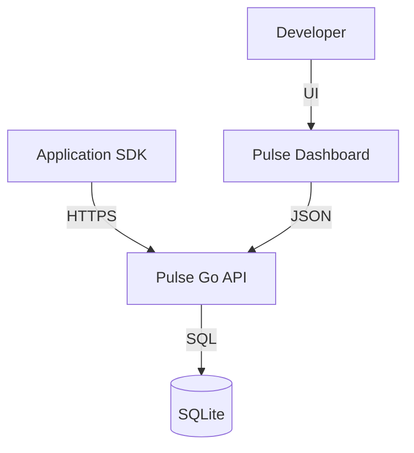

# Pulse

### Minimalist, High-Performance Error Tracking for Modern Dev Teams.

Pulse is an open-source, self-hosted error monitoring solution designed for developers who value speed, simplicity, and complete control over their data. Built with **Go**, **Svelte**, and **SQLite**, Pulse provides a high-fidelity experience without the bloat of traditional enterprise tools.

> [!IMPORTANT]
> Pulse is fully compatible with existing Sentry SDKs. You can drop it into your existing stack in seconds.

---

## Features

- **Blazing Fast**: Near-zero latency ingestion and a high-performance, single-binary architecture.
- **Privacy First**: Your data stays in your infrastructure. Periodic SQLite backups are all you need.
- **Modern UI**: A developer-centric, high-contrast dashboard inspired by terminal aesthetics.
- **Sentry Compatible**: Full support for Sentry's DSN format and official SDKs (JS, Python, Go, etc.).
- **Lightweight**: Minimalist resource footprint—perfect for side projects or internal microservices.
- **Real-time Analytics**: Instant visibility into error spikes, environment trends, and user impact.

## Quick Start (Docker)

The easiest way to deploy Pulse is using Docker Compose.

1. **Create a `docker-compose.yml` file:**

```yaml
version: '3.8'

services:
  pulse:
    image: nitrocode/pulse:latest
    ports:
      - "8080:8080"
    environment:
      - ADMIN_EMAIL=admin@example.com
      - ADMIN_PASSWORD=securepassword
      - JWT_SECRET=change-me-to-something-random
    volumes:
      - pulse-data:/app/data

volumes:
  pulse-data:
```

2. **Run the container:**

```bash
docker-compose up -d
```

3. **Login:**
Navigate to `http://localhost:8080` and use your credentials.

---

## Integration

Pulse generates a unique DSN for every project. Simply initialize your favorite Sentry-compatible SDK:

### JavaScript / TypeSript
```javascript
import * as Sentry from "@sentry/browser";

Sentry.init({
  dsn: "http://your-api-key@pulse.yourdomain.com/project-id",
});
```

### Go
```go
import "github.com/getsentry/sentry-go"

sentry.Init(sentry.ClientOptions{
    DSN: "http://your-api-key@pulse.yourdomain.com/project-id",
})
```

---

## Architecture

Pulse is designed for operational simplicity:

- **Frontend**: Svelte + Vite (Single Page App)
- **Backend**: Go (Stateless API Server)
- **Database**: SQLite (WAL mode enabled for high-concurrency ingestion)
- **Auth**: JWT-based secure sessions



---

## Database Migrations

Pulse includes an automatic database migration system that runs on container startup. Migrations are tracked and applied idempotently.

### How It Works

- Migrations stored in `migrations/` directory are automatically applied
- Each migration runs only once (tracked in `schema_migrations` table)
- Migrations execute in alphabetical order on container start
- Failed migrations prevent the application from starting

### Creating New Migrations

```bash
# 1. Create migration file
echo "ALTER TABLE projects ADD COLUMN new_field TEXT;" > migrations/2024-01-21_add_new_field.sql

# 2. Rebuild and deploy
docker build -t pulse:latest .
docker-compose up -d

# Migrations run automatically on startup!
```

For detailed migration documentation, see [README_MIGRATIONS.md](README_MIGRATIONS.md).

---

## Security

We take security seriously. Please refer to our [SECURITY.md](./SECURITY.md) for vulnerability reporting.

## Contributing

We welcome contributions of all sizes! Check out our [CONTRIBUTING.md](./CONTRIBUTING.md) to get started.

## License

Pulse is open-source software licensed under the [MIT License](./LICENSE).

---

<p align="center">
  Built with love by PipeOps
</p>